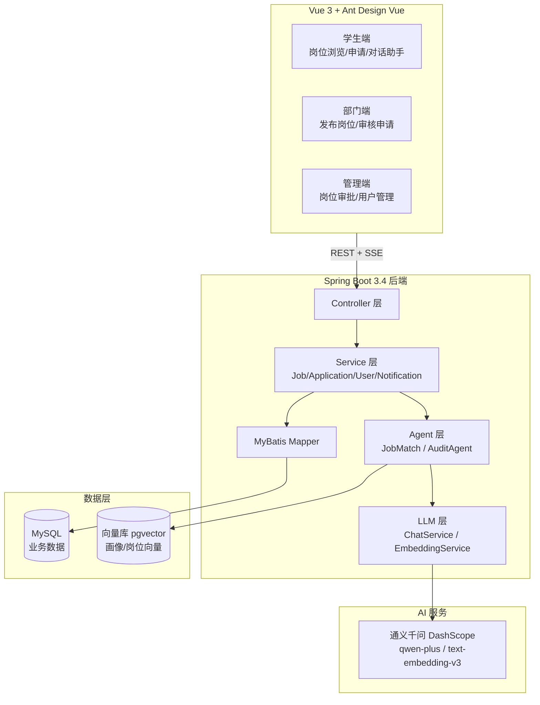

# 🎓 校园智能求职与审核平台（campus-workstudy-agent）

> 基于 **Spring Boot 3.4 + Vue 3 + Spring AI Alibaba** 的校园勤工俭学系统 —— 在传统"信息发布 + 人工审核"基础上，引入 **LLM Agent** 实现智能求职推荐、对话式求职助手与 AI 辅助审核。
>
> **Java + LLM Agent 应用开发实战项目**（面向 AI 应用工程师方向）。


---

## ✨ 核心亮点

| 模块 | 说明 |
|---|---|
| 🤖 **智能求职推荐 Agent**（规划中 P2） | 学生画像构建 → 岗位向量化（text-embedding-v3）→ 多路召回 + LLM 精排，输出**可解释推荐理由** |
| 💬 **对话式求职助手**（规划中 P3） | ReAct 模式 + **Function Calling**（找岗/看详情/直接申请），SSE 流式输出 |
| 🧑⚖️ **智能审核 Agent**（规划中 P4） | 规则引擎 + LLM **结构化输出**（JSON Schema）生成预审报告，**Human-in-the-Loop** 人机协同 |
| 🔐 **纵深安全体系** | 默认拒绝 + `@RequireRole` AOP 鉴权 + 数据级越权防护 + 文件白名单，28 个单元测试全绿 |
| 📦 **工程化** | JWT 认证、AOP 操作日志、通知闭环、服务端分页（PageHelper）、CSV 导出、Docker 一键部署 |

---

## 🏗️ 系统架构



---

## 🧩 技术栈

**后端**
- Spring Boot 3.4.5 / Java 21
- Spring AI Alibaba 1.0.0.2（DashScope 通义千问：`qwen-plus` 对话、`text-embedding-v3` 向量）
- Spring Security + JWT（无状态认证）
- MyBatis + MySQL 8 + PageHelper
- Spring AOP（操作日志 / 角色鉴权切面）、@Scheduled 定时任务
- EasyExcel、Knife4j（OpenAPI 文档）、Actuator 健康检查

**前端**
- Vue 3（Composition API）+ Vite + Vue Router
- Ant Design Vue + Axios（401/403 统一拦截）

**部署**
- Docker Compose（MySQL + Backend + Nginx）

---

## 📁 目录结构

```
backend/
├── src/main/java/com/workstudy/
│   ├── agent/          # Agent 模块（P2/P3/P4）
│   ├── llm/            # LLM 封装：ChatService / EmbeddingService / PromptTemplates
│   ├── controller/     # REST 接口（含 LlmController 冒烟接口）
│   ├── service/        # 业务逻辑（Job/Application/User/Notification）
│   ├── mapper/         # MyBatis Mapper
│   ├── aspect/         # AOP：@LogOperation 日志、@RequireRole 鉴权
│   ├── config/         # SecurityConfig（默认拒绝 + 白名单）
│   ├── entity/ vo/ common/ filter/ task/ utils/
├── src/main/resources/ # application.yml / application-dev.yml
└── src/test/           # 28 个单元测试
frontend/
├── src/components/     # 各角色页面组件
├── src/views/          # 学生/部门/管理端视图
└── src/router/         # 路由（含角色守卫）
database/init.sql       # 建库建表 + 种子数据
docs/                   # 升级设计方案 + 开发修改记录（面试材料）
```

---

## 🚀 快速开始

### 环境要求
- JDK 21、Maven 3.9+、Node.js 18+、MySQL 8
- DashScope API Key（[阿里云百炼](https://bailian.console.aliyun.com/) 申请，有免费额度）

### 1. 初始化数据库

```sql
-- 执行 database/init.sql（创建 workstudy 库、表结构、种子账号）
mysql -uroot -p < database/init.sql
```

### 2. 配置环境变量

```powershell
# 参考 backend/.env.example
$env:DASHSCOPE_API_KEY = "sk-你的key"   # 通义千问 API Key
$env:DB_PASSWORD = "你的MySQL密码"        # 默认 root
```

### 3. 启动后端

```bash
cd backend
mvn spring-boot:run          # 默认 dev profile，端口 8080
# 验证 LLM 链路：
#   POST /api/llm/chat   {"message":"你好"}   → qwen-plus 回复
#   POST /api/llm/embed  {"text":"图书馆助理"} → 1024 维向量
```

### 4. 启动前端

```bash
cd frontend
npm install
npm run dev                  # 默认 http://localhost:5173
```

### 5. （可选）Docker 一键部署

```bash
docker compose up -d         # MySQL + 后端 + Nginx 前端
```

### 默认账号（密码均为 123456）

| 账号 | 角色 |
|---|---|
| `admin` | 超级管理员（审批岗位、用户管理） |
| `dept1` | 部门管理员（发布岗位、审核申请） |
| `student1` | 学生（浏览岗位、在线申请） |

---

## 🧪 测试

```bash
cd backend
mvn test    # 28 个测试：认证 / 岗位服务 / 申请服务 / 用户服务
```

---

## 🗺️ 开发路线

| 阶段 | 内容 | 状态 |
|---|---|---|
| P0 | 安全加固（默认拒绝/角色鉴权/越权修复/文件安全）、状态机 bug、通知闭环、服务端分页 | ✅ 完成 |
| P1 | Spring AI Alibaba 接入（DashScope 对话 + Embedding，链路已验证） | ✅ 完成 |
| P2 | Agent 1 智能求职推荐：画像构建 + 岗位向量化 + 多路召回 + LLM 精排 | 🚧 进行中 |
| P3 | Agent 1 对话式求职助手：Function Calling + SSE 流式 | ⏳ 规划 |
| P4 | Agent 2 智能审核：规则引擎 + 结构化报告 + Human-in-the-Loop | ⏳ 规划 |

---

## 📚 文档

- [Java + Agent 升级设计方案](docs/Java-Agent升级设计方案.md) —— 架构设计、Agent 详细设计、技术选型对比
- [开发修改记录](docs/开发修改记录.md) —— 全部改动与面试追问预案

## ⚠️ 安全说明

- API Key 一律通过环境变量注入，禁止硬编码（`backend/.env.example` 为模板）
- `.gitignore` 已排除密钥、构建产物、上传文件等敏感内容
